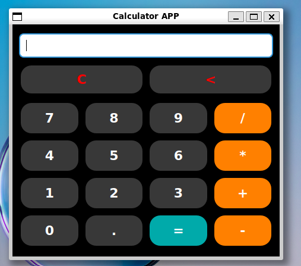

# Desktop Calculator

A simple desktop calculator application built with **Python** and **PyQt5**. The application provides a graphical interface for performing basic arithmetic calculations.

## Features

- Addition, Subtraction, Multiplication, Division
- User-friendly graphical interface
- Interactive calculator buttons
- Clear and Backspace functionality

## Technologies

- **Python 3**
- **PyQt5**

## Requirements

The required Python packages are listed in `requirements.txt`.

Install the dependencies with:

    pip install -r requirements.txt

##  Installation

### 1. Clone the repository

    git clone https://github.com/your-username/your-repository.git
    cd your-repository

### 2. Install the dependencies

    pip install -r requirements.txt

### 3. Run the application

    python main.py

##  Author

Johannes Malefetsane 

